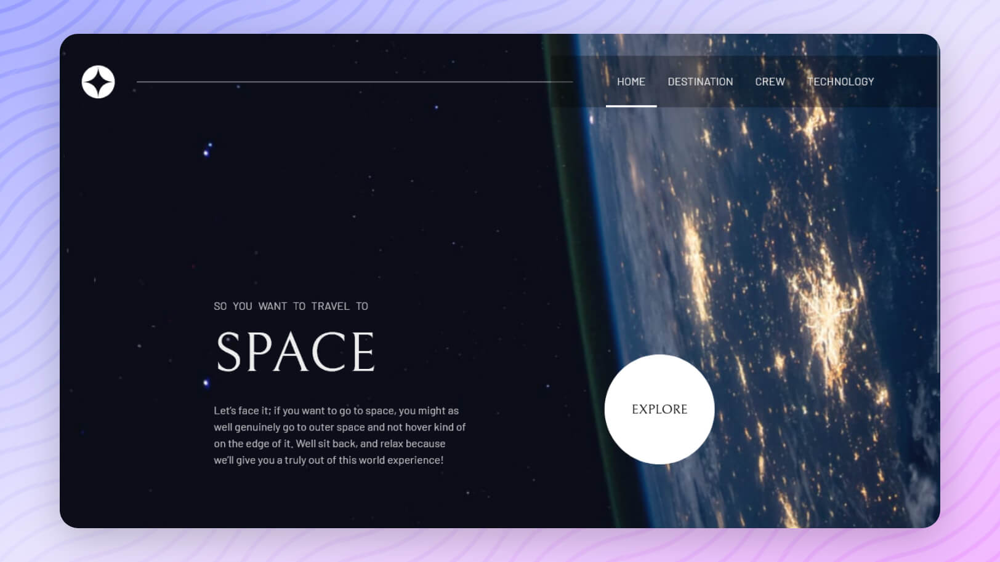

<div align="center">

  <!--  -->
  

  <h2>Space Tourism</h2>

  <h3>
    <a href="https://space-tourism-codepapa.vercel.app">
      <strong>View Demo</strong>
    </a> 
    || 
    <a href="https://www.frontendmentor.io/solutions/space-tourism-website-w-reactjs-GbYaAoC2Nc">
      <strong>Frontend Mentor</strong>
    </a>
  </h3>

  <div align="center">
    <a href="https://github.com/CodePapa360/Space-Tourism-website/issues">Report Bug</a>
    •
    <a href="https://github.com/CodePapa360/Space-Tourism-website/pulls">Request Feature</a>
  </div>

  <hr>

</div>

<!-- Badges -->
<div align="center">

<!-- Status -->


<!-- Liceensee -->


<a href='https://www.twitter.com/CodePapa360' target="_blank"></a>
<a href='https://www.linkedin.com/in/codepapa360' target="_blank"></a>

</div>

<!-- Brief -->
<p align="center">
A multi-page space tourism website — discover destinations, meet the crew, and delve into technology. 🚀🌌
</p>

<!-- Screenshot -->
<a align="center" href="https://space-tourism-codepapa.vercel.app">



</a>

## Table of contents📚

- [Key Features](#key-features)
- [Links](#links)
- [My process](#my-process)
  - [Built with](#built-with)
  - [What I learned](#what-i-learned)
- [Installation](#installation)
- [Author](#author)
- [Acknowledgments](#acknowledgments)
- [License](#license)

## Key Features🎉

Users should be able to:

- View each page and be able to toggle between the tabs to see new information
- View the optimal layout for each of the website's pages depending on their device's screen size
- See hover states for all interactive elements on the page

## Links

- View Demo - https://space-tourism-codepapa.vercel.app
- Solution page - [https://www.frontendmentor.io/solutions/...](https://www.frontendmentor.io/solutions/space-tourism-website-w-reactjs-GbYaAoC2Nc)

## My process🛠️

### Tech Stack🏗️

- React
- React router
- Styled components
- Vite

### What I Learned💡

During the development of the Space Tourism Website, I encountered several challenges and gained valuable insights into various aspects of web development. Here are some of the key learnings:

#### Dynamic Backgrounds with React Router and Styled Components

One of the challenges I faced was dynamically changing the background image based on the page the user navigates to. I wanted to provide a visually appealing experience by adjusting the background according to each page. Here's how I tackled this challenge:

```css
const StyledAppLayout = styled.div.withConfig({
  shouldForwardProp: (prop) => "pageLocation" !== prop,
})`
  background-image: ${(props) =>
    `url("/images/${props.pageLocation}/background-${props.pageLocation}-mobile.jpg")`};

  @media screen and (min-width: 768px) {
    background-image: ${(props) =>
      `url("/images/${props.pageLocation}/background-${props.pageLocation}-tablet.jpg")`};
  }

  @media screen and (min-width: 1024px) {
    background-image: ${(props) =>
      `url("/images/${props.pageLocation}/background-${props.pageLocation}-desktop.jpg")`};
  }

  // Additional styles...
`;
```

I utilized React Router's `useLocation` hook to get the current location, extracted the page name, and passed it as a prop to my styled component. Leveraging `styled-components` allowed me to dynamically set background images based on the page, creating a seamless transition between pages.

#### React Router and Conditional Redirects

Implementing conditional redirects with React Router was crucial for ensuring a smooth user experience. For instance, when a user lands on the `/crew` route without specifying a particular crew member. To address this, I implemented conditional redirects using React Router. Here's a breakdown of the solution:

```jsx
function CrewContents() {
  const crews = jsonData.crew;
  const { name: crewName } = useParams();
  const activeName = crewName || crews[0].name;
  const currentCrew = crews.find((crew) => crew.name === activeName);

  // Redirect to the first crew member if no specific crew is selected
  if (!crewName) {
    return <Navigate to={`/crew/${crews[0].name}`} replace />;
  }

  // Redirect to a 404 page if the specified crew member is not found
  if (!currentCrew) {
    return <NotFound />;
  }

  // Rest of the component rendering
  return (
    // ...
  );
}
```

In this code snippet, I first check if `crewName` is not provided, and if so, I redirect the user to the first crew member's page. Additionally, if the specified crew member is not found in the dataset, a redirect to a custom NotFound page is implemented.

This approach ensures a seamless user experience, providing default navigation when needed and gracefully handling scenarios where a crew member is not found.

## Installation📥

- Clone this repo:

```sh
git clone https://github.com/CodePapa360/Space-Tourism-website.git
```

- Install dependencies:

```sh
npm install
```

- Build command:

```sh
npm run build
```

- Live server:

```sh
npm run dev
```

## Author👤

<b>Alamin</b>

- Twitter - [@CodePapa360](https://www.twitter.com/CodePapa360)
- LinkedIn - [@CodePapa360](https://www.linkedin.com/in/codepapa360)
- Frontend Mentor - [@CodePapa360](https://www.frontendmentor.io/profile/CodePapa360)
- Github: [@CodePapa360](https://github.com/codepapa360)

Feel free to contact me with any questions or feedback!

## Star this project🌟

Show your appreciation by starring this project on GitHub.🙂 Your support will motivate me to continue creating and sharing valuable open-source projects

## Acknowledgments🙏

I would like to express my gratitude to Frontend Mentor for providing the challenge and inspiration to build this project. Their platform and resources have been instrumental in my learning journey and the development of this project.

## License📜

This project is licensed under the [MIT](./LICENSE.md) License - see the LICENSE file for details.
